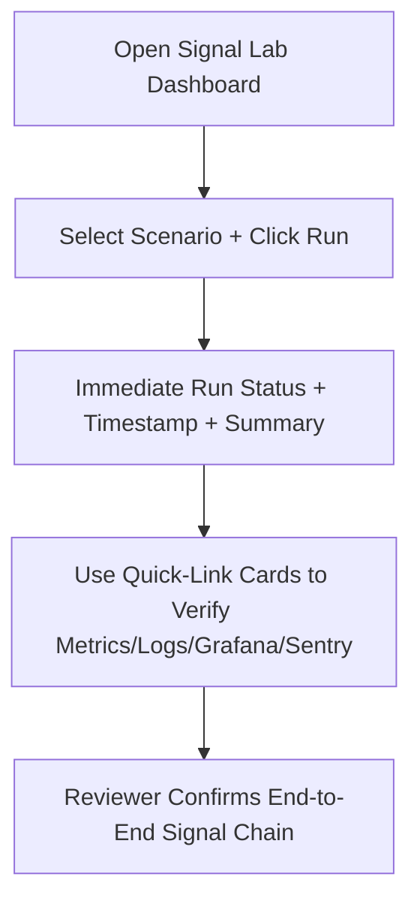
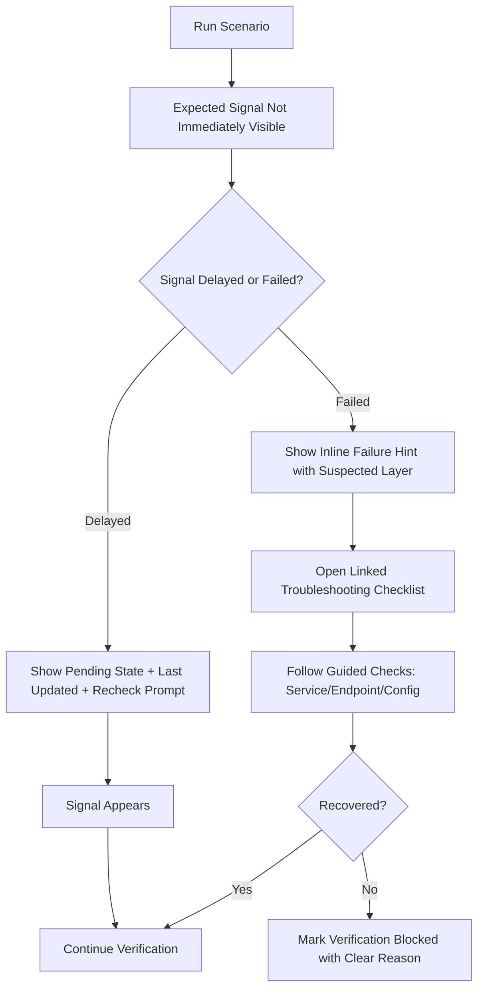

---
stepsCompleted:
  - 1
  - 2
  - 3
  - 4
  - 5
  - 6
  - 7
  - 8
  - 9
  - 10
  - 11
  - 12
  - 13
  - 14
lastStep: 14
inputDocuments:
  - _bmad-output/signal-lab-product-brief.md
  - _bmad-output/prd.md
  - _bmad-output/project-context.md
  - ASSIGNMENT.md
  - RUBRIC.md
  - SUBMISSION_CHECKLIST.md
---

# UX Design Specification Signal Lab Assignment

**Author:** BMad
**Date:** 2026-04-14

---

<!-- UX design content will be appended sequentially through collaborative workflow steps -->

## Executive Summary

### Project Vision

Signal Lab should feel like a polished engineering instrument: coherent, professional, and calm under pressure. In a 15-minute evaluation window, the interface must help a technical reviewer move from "can I trust this?" to "this is clearly production-minded" without friction. The experience is intentionally desktop-first and optimized for clarity, reliability, and fast verification.

### Target Users

Primary users are technical interviewers reviewing assignment quality under strict time constraints. They value clean execution, predictable behavior, and immediate observability evidence over feature breadth.

Secondary users are developers/maintainers who need quick diagnostics and confidence that failures are understandable and recoverable. Their needs include traceability, clear system states, and straightforward pathways to verify metrics, logs, dashboards, and errors.

### Key Design Challenges

- **Perceived reliability in seconds:** The UI must communicate stability and professionalism immediately, with no obvious glitches or ambiguous interaction states.
- **Observability immediacy under real-world delay:** Since delayed logs/metrics are the most likely failure mode, the UX must make pipeline timing visible and understandable rather than appearing broken.
- **Reviewer-speed interaction design:** The core scenario run flow must be intuitive and fast, with minimal cognitive load and no hidden steps.
- **Desktop-first information density:** The layout should prioritize high-signal operational data and quick actionability for desktop screens.

### Design Opportunities

- **Confidence-first dashboard framing:** An engineering dashboard UX can front-load trust via clean structure, meaningful status indicators, and explicit verification pathways.
- **Latency-aware feedback patterns:** Introduce "signal pending" and "last updated" cues so delayed telemetry feels controlled, not erroneous.
- **Scenario excellence as signature moment:** A well-thought-out, quick, and reliable scenario run journey can become the standout reviewer impression.
- **Traceability as UX advantage:** Consistent run identifiers and linked evidence points can turn technical correctness into an intuitive, auditable user experience.

## Core User Experience

### Defining Experience

The core experience of Signal Lab centers on running scenarios and immediately validating outcomes. The primary user loop is: trigger scenario -> observe result state -> verify observability evidence. UX success depends on preserving speed, clarity, and confidence at each step so users never wonder what happened or where to look next.

### Platform Strategy

Signal Lab is a desktop-first web experience optimized for mouse/keyboard workflows and high information density. The interaction model should emphasize fast scanning, clear status feedback, and parallel visibility of key controls and outcomes. Offline capability is out of scope; the product assumes active local service connectivity for real-time observability verification.

### Effortless Interactions

- Running a scenario should be immediate, obvious, and require no interpretation.
- Post-run result visibility should be instant, with explicit success/error status and no ambiguous idle state.
- Observability verification should use separate quick-link cards so users can jump directly to each destination (metrics, logs, Grafana, Sentry) without hunting.
- Navigation between run output and observability endpoints should feel deterministic and frictionless.
- Users should never second-guess where to find evidence for a given scenario execution.

### Critical Success Moments

- The make-or-break moment is immediately after scenario execution: users must see clear result feedback without delay or uncertainty.
- First-time success occurs when the user runs a scenario and can instantly identify where expected metrics, logs, and errors should appear.
- The "this is better" moment is when observability evidence appears exactly as expected and is clearly connected to the triggered scenario.
- Any delay in signal visibility must be communicated as controlled system state (not failure ambiguity) to preserve trust.

### Experience Principles

- **Action-to-evidence continuity:** Every run action must flow directly into visible and verifiable outcomes.
- **Zero-hunt navigation:** Observability destinations are always explicit, one-step reachable, and clearly labeled.
- **Immediate state clarity:** System feedback appears instantly and leaves no ambiguity about current run status.
- **Confidence through determinism:** The interface should behave predictably so technical reviewers trust what they see.

## Desired Emotional Response

### Primary Emotional Goals

Signal Lab should make users feel confident, oriented, and in control from the first interaction. The emotional target is not excitement but professional assurance: the interface should communicate that the system is stable, predictable, and ready to verify real outcomes.

During core actions, the dominant emotional state should be calm control. After completing a scenario run and verification, users should feel clear confidence in both the system and their own understanding of what happened.

### Emotional Journey Mapping

- **First discovery:** Users feel oriented immediately, with clear entry points and no ambiguity about where to begin.
- **During scenario execution:** Users feel calm and controlled through predictable feedback and stable interaction behavior.
- **After successful run:** Users feel confidence that expected metrics/logs/errors appeared correctly and are easy to verify.
- **If signals are delayed:** Users remain patient and reassured because the interface clearly communicates that updates are in progress.
- **On return usage:** Users feel familiarity and trust, expecting the same deterministic flow each time.

### Micro-Emotions

- **Most critical axis:** Confidence over confusion.
- **Supporting micro-emotions:** Trust, clarity, and composure during system response windows.
- **Success micro-emotion:** Accomplishment through fast, reliable verification.
- **Priority emotional safeguard:** Prevent uncertainty from turning into frustration when observability signals take time to appear.

### Design Implications

- **Confidence and orientation** -> Provide immediate visual hierarchy with explicit "start here" affordances and stable layout behavior.
- **Calm control** -> Use deterministic status messaging and predictable transitions for run states (idle/loading/success/error).
- **Reassuring delay handling** -> Surface clear "updating" or "signal pending" states with concise explanatory copy, rather than silent waiting.
- **Confusion prevention** -> Keep observability destinations explicit with separate quick-link cards and direct labels.
- **Frustration avoidance** -> Eliminate hidden steps, ambiguous states, and unclear ownership of next action.

### Emotional Design Principles

- **Clarity first:** Every screen should answer "what can I do now?" and "what just happened?"
- **Predictable feedback:** User actions must produce immediate, understandable system responses.
- **Reassuring transparency:** When data is delayed, communicate progress and expected behavior clearly.
- **Confidence by design:** Visual and interaction choices should consistently reinforce reliability and professional polish.
- **Zero-confusion paths:** Navigation and verification flows should be obvious, explicit, and repeatable.

## UX Pattern Analysis & Inspiration

### Inspiring Products Analysis

- **Grafana:** Strong dashboard clarity, high-signal information hierarchy, and immediate visual feedback for system state.
- **Notion:** Modular, flexible structure that keeps complex content organized without feeling rigid; supports composable layout thinking.
- **Slack:** Immediate interaction feedback and responsive UI behavior that keeps users confident their action was received and processed.

These products collectively support Signal Lab's UX direction: clean engineering presentation, predictable structure, and fast feedback under pressure.

### Transferable UX Patterns

- **Dashboard clarity (Grafana):**
  - Use clear sectioning and card-based grouping for scenario control, run results, and observability links.
  - Prioritize high-signal metrics/status indicators above secondary details.
  - Maintain visual consistency so users can scan state quickly.

- **Modular layout system (Notion):**
  - Build the UI from modular blocks (scenario runner, run output, verification links, recent history) that can evolve without breaking cohesion.
  - Keep spacing, alignment, and component rhythm consistent to preserve perceived professionalism.
  - Use progressive disclosure for secondary details while preserving a simple top-level experience.

- **Immediate feedback loops (Slack):**
  - Provide instant state acknowledgment on run action (loading/progress/success/error).
  - Confirm system responsiveness even when backend signals are still propagating.
  - Use concise status messaging to reduce uncertainty and avoid repeated actions.

### Anti-Patterns to Avoid

- Hidden or ambiguous next steps after running a scenario.
- Overly dense dashboards that bury critical run status and verification entry points.
- Silent waiting states that create confusion during delayed observability propagation.
- Inconsistent layout behavior between sections that undermines trust and perceived quality.
- Excessive animation or visual noise that distracts from core verification tasks.

### Design Inspiration Strategy

**What to Adopt:**
- Grafana-inspired clarity for information hierarchy and signal-first layout.
- Slack-style immediate response cues for action feedback and system acknowledgment.
- Notion-style modular composition to keep the interface extensible and maintainable.

**What to Adapt:**
- Adapt Grafana's density into a reviewer-friendly assignment context (cleaner, fewer but more purposeful panels).
- Adapt Notion's flexibility into structured modules with strict deterministic flow.
- Adapt Slack-like feedback to observability latency states with reassuring, technical-accurate messaging.

**What to Avoid:**
- Generic dashboard sprawl without clear action-to-evidence flow.
- Flexible layouts that sacrifice predictability.
- Feedback patterns that imply failure when telemetry is simply delayed.

## Design System Foundation

### 1.1 Design System Choice

Signal Lab will use a **themeable design system approach** built on **shadcn/ui + Tailwind CSS** within the existing Next.js stack. This provides a reliable component foundation while preserving enough flexibility to shape a clean, professional, engineering-focused interface.

### Rationale for Selection

- **Balanced priority fit:** This approach balances delivery speed with tailored UX quality, matching project constraints and evaluation goals.
- **Stack alignment:** shadcn/ui and Tailwind are already required by the assignment context, reducing integration risk and keeping implementation coherent.
- **Professional clarity:** The system supports a clean dashboard structure with controlled visual hierarchy and predictable interaction patterns.
- **Customization without reinvention:** It enables slight brand expression (accent styling) without the overhead of a fully custom component system.
- **Maintainability:** Consistent component primitives improve long-term readability, modularity, and iterative refinement.

### Implementation Approach

- Use shadcn/ui primitives as the baseline for cards, buttons, forms, status surfaces, and navigation elements.
- Establish layout sections as modular dashboard blocks: scenario runner, run status/results, observability quick links, and recent history.
- Apply Tailwind utility patterns consistently for spacing, typography rhythm, and section hierarchy.
- Prioritize comfortable density for readability while preserving scanning speed on desktop.
- Keep dark mode out of scope for this phase to maintain focus and reduce visual QA surface area.
- Enforce baseline accessibility with **AA core** practices across contrast, focus states, labels, and keyboard navigation.

### Customization Strategy

- Use a **slightly branded accent** palette for key interactive and status elements while keeping the base UI neutral and technical.
- Keep semantic color mapping explicit (success, warning/pending, error, info) to reinforce confidence and state clarity.
- Define reusable style tokens for spacing, radius, typography scale, and state colors to ensure consistency.
- Create a small set of project-specific composed components (for run status and observability link cards) on top of shadcn primitives.
- Avoid heavy visual flourishes; emphasize stable layout behavior, clear status communication, and deterministic interaction feedback.

## 2. Core User Experience

### 2.1 Defining Experience

Signal Lab is the fastest way to generate scenarios and instantly see metrics and logs in a coherent, reviewer-friendly flow. The defining interaction is a single run action that immediately transitions into observable, traceable evidence without forcing users to manually stitch together multiple tools.

The product's value is realized when users can run a scenario and move directly from action to confidence with minimal friction and no ambiguity.

### 2.2 User Mental Model

Users expect scenario execution to behave like a command with immediate acknowledgment and clear output states. They mentally model the workflow as: trigger event -> system processes -> evidence appears.

Current behavior in comparable setups is fragmented: users jump between separate tools and tabs, manually correlate outputs, and lose time in context switching. This creates uncertainty and cognitive load.

In Signal Lab, users should not need to guess where to look next. Their expectation is clear continuity from trigger to verification, with stable guidance at each step.

### 2.3 Success Criteria

The defining interaction succeeds when:

- Users can trigger a scenario in one obvious action.
- Feedback appears immediately (within ~1 second) acknowledging the run and current processing status.
- The interface communicates expected next outcomes clearly while signals propagate.
- Completion state includes:
  - clear scenario status message,
  - timestamp,
  - brief summary of results.
- Users can move to verification targets (metrics/logs/dashboard/error) without hunting or second-guessing.

### 2.4 Novel UX Patterns

Signal Lab should intentionally favor established UX patterns over novelty for this assignment context.

- **Pattern approach:** familiar forms, cards, status indicators, and explicit action/result sections.
- **Why:** reviewers are time-constrained and should spend attention on system validity, not learning a new interaction model.
- **Innovation strategy:** improve execution quality of familiar patterns (speed, clarity, deterministic feedback), rather than introducing unfamiliar controls.

### 2.5 Experience Mechanics

**1. Initiation**
- User lands on dashboard and sees clear primary action area for scenario run.
- Scenario selection and run trigger are visibly grouped with "start here" clarity.

**2. Interaction**
- User selects scenario and clicks Run.
- System immediately reflects action acknowledgment and transitions to running state.
- UI preserves context (selected scenario and run focus) throughout execution.

**3. Feedback**
- Immediate status confirmation appears (e.g., running/pending).
- UI sets expectations that observability signals are being processed.
- If delayed, interface reassures users with explicit pending/progress messaging, not silence.

**4. Completion**
- User sees a clear completion block with scenario result, timestamp, and short summary.
- Verification links/cards are immediately actionable for next-step inspection.
- User can confidently conclude whether the run succeeded and where evidence is available.

## Visual Design Foundation

### Color System

Signal Lab uses a neutral-first palette with a slightly branded accent to communicate professionalism, stability, and clarity under review pressure.

- **Base neutrals:** cool gray scale for backgrounds, borders, and text hierarchy.
- **Primary accent:** restrained blue-cyan tone for interactive emphasis and key highlights.
- **Semantic states:**
  - Success: clear green
  - Warning/Pending: amber
  - Error: controlled red
  - Info: blue
- **Usage strategy:**
  - Keep color meaning consistent across run status, cards, badges, and links.
  - Use accent sparingly for action guidance and confidence signals.
  - Avoid decorative color noise that competes with operational information.

### Typography System

Typography should feel modern, technical, and calm with strong readability in dashboard contexts.

- **Primary typeface:** clean sans-serif system stack optimized for UI clarity.
- **Hierarchy strategy:**
  - H1/H2 for page and section orientation
  - H3/card titles for module scanning
  - Body text optimized for concise operational messaging
  - Monospace reserved for run IDs, timestamps, and technical values
- **Tone:** professional and neutral, with no playful stylistic choices.
- **Readability focus:** prioritize legibility and fast scanability over dense decorative styling.

### Spacing & Layout Foundation

Layout should feel comfortable and structured, not cramped, while preserving fast information access.

- **Spacing unit:** 8px base spacing system for consistency and rhythm.
- **Density target:** comfortable density with clear module boundaries.
- **Grid/layout approach:**
  - desktop-first responsive grid
  - modular card sections for scenario control, run output, observability links, and history
- **Structure principles:**
  - stable visual hierarchy from action -> status -> verification
  - predictable spacing between modules to reduce cognitive load
  - preserve alignment consistency to reinforce quality perception

### Accessibility Considerations

Signal Lab targets **AA core** accessibility baseline for key reviewer flows.

- Ensure sufficient contrast for text, controls, and status indicators.
- Preserve visible focus states across all interactive elements.
- Use semantic labels for form controls and status outputs.
- Avoid color-only status communication; pair color with text/icon labels.
- Keep typography sizes and spacing readable for extended technical review sessions.

## Design Direction Decision

### Design Directions Explored

The team explored six visual directions covering modular dashboard layouts, signal-first status emphasis, minimal low-noise variants, guided sidebar navigation, and evidence-timeline models. Each direction was evaluated against core goals: confidence in seconds, zero-hunt verification, immediate feedback, and professional clarity.

### Chosen Direction

**Chosen approach:** Hybrid of **Direction 1 (Balanced Command Center)** and **Direction 2 (Signal-First Header)**.

**Direction 1 elements retained:**
- Modular card-based content structure for scenario runner, latest run output, observability quick links, and supporting context.
- Comfortable density and calm visual rhythm.
- Clear section boundaries and predictable scanning flow.

**Direction 2 elements integrated:**
- High-visibility top status strip showing critical telemetry/run indicators.
- Immediate signal summary presentation (e.g., run state, latest metric/log capture indicators).
- Stronger "system is working" reassurance at first glance.

### Design Rationale

This hybrid best satisfies Signal Lab's evaluation context:

- It preserves a clean, professional command-center layout without overwhelming users.
- It front-loads trust by making system state visible before users inspect details.
- It supports the defining interaction (run -> instant feedback -> verify evidence) with minimal cognitive overhead.
- It aligns with emotional goals of calm control, confidence, and reduced ambiguity during delayed signal propagation.

### Implementation Approach

- Use Direction 1 as the structural base (card layout and module composition).
- Add Direction 2 style top status band as a persistent summary layer above core modules.
- Keep status semantics explicit and consistent (running/pending/success/error with text + color + icon cues).
- Ensure the primary run action remains visually dominant in the first viewport.
- Preserve separate observability quick-link cards for direct reviewer navigation.
- Apply comfortable spacing and restrained accent usage to maintain clarity and polish.

## User Journey Flows

### Reviewer Success Path (Primary)

This flow optimizes for first-time reviewer confidence within a short evaluation window. It prioritizes immediate action, fast acknowledgment, and direct verification access.

**Flow intent:**
- Keep to 3-4 steps with no hidden navigation.
- Ensure action-to-evidence continuity is obvious.
- Make verification destinations explicit and one-click reachable.

### Reviewer Recovery Path (Delayed/Failed Signals)

This flow handles the highest-risk demo scenario: expected telemetry not appearing immediately. It preserves trust by distinguishing delay from failure and offering clear recovery actions.

**Flow intent:**
- Preserve calm control during delay windows.
- Prevent confusion by labeling system state explicitly.
- Support deterministic recovery with both inline and linked guidance.

### Journey Patterns

- **Navigation patterns**
  - Start from one clear primary action panel.
  - Move from action -> status -> verification via explicit cards.

- **Decision patterns**
  - Distinguish delayed propagation from true failure.
  - Offer next-best action immediately after each branch.

- **Feedback patterns**
  - Instant action acknowledgment after Run.
  - Timestamped state messaging with concise progress/failure language.
  - Clear completion summary before external verification jumps.

### Flow Optimization Principles

- Minimize reviewer steps to value (3-4 step happy path).
- Keep run history as **secondary** information to reduce primary-path noise.
- Use progressive disclosure: show only what's needed for the current step.
- Combine inline troubleshooting hints with linked checklist depth for reliability.
- Maintain trust through deterministic labels, not ambiguous waiting states.

## Component Strategy

### Design System Components

Signal Lab will use shadcn/ui + Tailwind as the component foundation for core primitives and layout consistency.

**Primary foundation components:**
- Button, Input/Select, Label
- Card, Badge, Separator
- Alert, Tooltip, Skeleton
- Table/List primitives for run history
- Toast/inline status messaging primitives

These cover most structural and interaction needs while keeping implementation aligned with the chosen design system.

### Custom Components

### RunStatusStrip

**Purpose:** Persistent high-visibility summary of current run and signal state.  
**Usage:** Displayed at top of dashboard; becomes sticky once a run starts.  
**Anatomy:** Run ID, scenario name, overall state, per-signal mini-indicators, last-updated timestamp.  
**States:** Idle, Running, Partial (some pending), Success, Failed.  
**Variants:** Compact (default), Expanded (with details).  
**Accessibility:** Landmark/region label, status text not color-only, keyboard-focusable links where interactive.  
**Content Guidelines:** Keep copy short, timestamp explicit, avoid verbose diagnostics.  
**Interaction Behavior:** Updates in near real-time; sticky top behavior after execution begins.

### ScenarioRunnerCard

**Purpose:** Main action surface for selecting and executing scenarios.  
**Usage:** First viewport primary module.  
**Anatomy:** Scenario selector, run trigger, short helper text, immediate acknowledgment area.  
**States:** Default, Submitting, Success Ack, Error Ack, Disabled (invalid selection/system unavailable).  
**Variants:** Default card; compact variant for smaller layouts if needed later.  
**Accessibility:** Proper form labeling, clear button semantics, focus order, keyboard submit support.  
**Content Guidelines:** One clear CTA, concise validation and status messaging.  
**Interaction Behavior:** Trigger run, lock duplicate submissions during processing, show immediate response.

### ObservabilityLinkGrid

**Purpose:** One-click access to metrics/logs/dashboard/error destinations.  
**Usage:** Post-run verification section and always visible secondary module.  
**Anatomy:** 4 link cards (Prometheus, Loki, Grafana, Sentry) with per-link state indicators.  
**States:** Ready, Pending, Failed, Unavailable.  
**Variants:** 2x2 desktop grid (default), stacked fallback for narrow widths.  
**Accessibility:** Descriptive link text, external navigation hints, state announced with text labels.  
**Content Guidelines:** Keep labels explicit and reviewer-oriented (avoid abbreviations).  
**Interaction Behavior:** Link cards remain clickable; state badges update as signal status changes.

### SignalHealthBadge

**Purpose:** Reusable atomic status indicator for individual signals and summary contexts.  
**Usage:** In RunStatusStrip, link cards, and run summary blocks.  
**Anatomy:** Icon + text + semantic color token.  
**States:** Running, Pending, Success, Error, Unknown.  
**Variants:** Inline, compact chip, emphasis badge.  
**Accessibility:** Must always include text label; icon/color supplementary only.  
**Content Guidelines:** Use consistent vocabulary across UI.  
**Interaction Behavior:** Non-interactive by default; can become interactive only when explicitly linked.

### RecoveryHintPanel

**Purpose:** Provide guided recovery when expected signals are delayed or failed.  
**Usage:** Appears contextually in recovery branch.  
**Anatomy:** Suspected failure layer, concise inline hints, "open checklist" action.  
**States:** Hidden, Delayed Guidance, Failure Guidance, Escalated Blocked State.  
**Variants:** Inline panel (default), expanded diagnostic mode.  
**Accessibility:** Clear heading, structured list semantics, actionable links with descriptive labels.  
**Content Guidelines:** Action-oriented instructions, no jargon overload, deterministic next steps.  
**Interaction Behavior:** Hints auto-selected by likely failure layer (API/Loki/Grafana/Sentry), with linked checklist for deeper troubleshooting.

### Component Implementation Strategy

- Build all custom components on top of shadcn primitives and established design tokens.
- Keep interaction/state vocabulary consistent across components (`running/pending/success/failed`).
- Reuse `SignalHealthBadge` as the single semantic status atom to avoid drift.
- Ensure all critical states are represented with text + icon + color.
- Keep run history secondary in composition and visual emphasis.
- Prioritize deterministic behavior and immediate feedback for all action surfaces.

### Implementation Roadmap

**Phase 1 - Core Components (critical path)**
- `ScenarioRunnerCard`
- `RunStatusStrip`
- `ObservabilityLinkGrid`
- `SignalHealthBadge`

**Phase 2 - Recovery Components**
- `RecoveryHintPanel`
- Failure-layer hint mapping and linked checklist integration
- Delayed vs failed branch messaging refinement

**Phase 3 - Enhancement Components**
- Variant polishing (compact/expanded modes)
- Microcopy refinement and visual consistency tuning
- Optional richer status detail interactions (without adding complexity to primary flow)

## UX Consistency Patterns

### Button Hierarchy

Signal Lab uses a strict three-tier action hierarchy to keep decisions fast and unambiguous.

- **Primary buttons:** one dominant action per section (e.g., Run Scenario).
- **Secondary buttons:** supporting actions adjacent to primary flow.
- **Tertiary actions:** low-emphasis text/link actions for optional or contextual tasks.

**Rules:**
- Never place multiple competing primary actions in the same visual group.
- Keep primary action placement consistent across states.
- Disable actions only with clear reason text when blocked.
- Preserve keyboard focus visibility and semantic button roles.

### Feedback Patterns

Signal Lab uses **inline status as the primary feedback channel**, with toasts as secondary reinforcement.

- **Inline first:** persistent status near the relevant component (run state, signal state, recovery hints).
- **Toast second:** short-lived confirmation for non-critical acknowledgments.
- **Status language:** deterministic and state-explicit (`running`, `pending`, `success`, `failed`).
- **Timing feedback:** include last-updated timestamps when signals are delayed.

**Rules:**
- Never rely on toast-only messaging for critical outcomes.
- Pair semantic color with icon + text labels.
- Keep feedback copy concise, operational, and actionable.

### Form Patterns

Scenario execution forms use predictable, low-friction validation.

- Validation is primarily **on submit**, with **inline field errors** shown when needed.
- Avoid aggressive live validation that interrupts normal input flow.
- Keep form structure minimal and single-purpose for reviewer speed.
- Show immediate post-submit acknowledgment state.

**Rules:**
- Error messages must explain what to fix, not just what failed.
- Preserve entered values on validation failure.
- Maintain consistent label placement and field grouping.

### Navigation Patterns

Signal Lab uses a **single-page dashboard model** with clear section anchors/cards rather than multi-page navigation.

- Action flow remains visible: run -> status -> verify.
- Module boundaries are explicit and stable.
- Observability destinations are reached via dedicated quick-link cards.
- Run history remains secondary and does not disrupt primary flow.

**Rules:**
- No hidden navigation dependencies in the critical path.
- Keep section order consistent with reviewer mental model.
- Minimize context-switching and backtracking.

### Additional Patterns

#### Loading, Empty, and Error States

**Loading states**
- Show immediate processing acknowledgment.
- Use clear pending messaging with expectation cues.

**Empty states**
- Every empty state includes explicit "what to do next" guidance.
- Empty states should point users back to the primary action.

**Error states**
- Distinguish delayed propagation from hard failure.
- Include inline recovery hints plus link to troubleshooting checklist.

#### Design System Integration Rules

- Implement all patterns using shadcn/ui primitives and shared tokens.
- Reuse component-level status vocabulary across cards, badges, and strips.
- Keep interaction semantics consistent across desktop modules.
- Enforce AA core accessibility for all pattern variants.

## Responsive Design & Accessibility

### Responsive Strategy

Signal Lab follows a **desktop-first strategy** aligned with reviewer usage patterns, while preserving mobile-safe fallback behavior for the critical run-and-verify workflow.

- **Desktop (primary target):**
  - Multi-module dashboard layout with clear action -> status -> verification hierarchy.
  - Comfortable density and simultaneous visibility of key modules.
  - Run history available but visually secondary.

- **Tablet (adaptive target):**
  - Simplified two-column or stacked hybrid layout depending on available width.
  - Maintain visibility of run action and latest status in first viewport.
  - Preserve quick-link verification access without deep navigation.

- **Mobile (fallback target):**
  - Prioritize only critical flow: Run -> status -> verify links.
  - De-emphasize secondary modules (e.g., history) via collapse/progressive disclosure.
  - Keep interactions simple, clear, and touch-safe for occasional use.

### Breakpoint Strategy

Signal Lab uses standard breakpoint ranges for predictable implementation and testing:

- **Mobile:** 320px - 767px
- **Tablet:** 768px - 1023px
- **Desktop:** 1024px+

**Breakpoint behavior rules:**
- Keep `RunStatusStrip` visible and readable at all breakpoints.
- Preserve primary action prominence regardless of layout collapse.
- Reflow cards vertically on narrow screens before reducing content clarity.
- Avoid hiding critical verification pathways behind multiple taps.

### Accessibility Strategy

Signal Lab targets **WCAG 2.1 AA** as the baseline accessibility standard.

**Core requirements:**
- Text contrast and status contrast meet AA thresholds.
- All critical actions and flows are keyboard-operable.
- Focus states are visible, consistent, and never removed.
- Status communication is never color-only (text + icon + semantic labels required).
- Form controls and verification links use clear accessible names.

**Product-specific accessibility priorities:**
- Fast comprehension for technical reviewers under time pressure.
- Deterministic status language for reduced cognitive load.
- Recovery guidance that is readable and actionable by assistive tech users.

### Testing Strategy

Responsive and accessibility quality is validated through a focused, repeatable test set.

**Responsive checks:**
- Validate key screens at widths: **375, 768, 1024, 1440**.
- Confirm critical path integrity (Run -> status -> verify) at each width.
- Verify card reflow does not obscure primary actions or signal states.

**Accessibility checks:**
- Keyboard-only pass for core workflow.
- Screen reader sanity pass on primary components and status outputs.
- Contrast checks for all semantic states (`running/pending/success/failed`).
- Focus order and focus visibility verification across interactive modules.

**Regression approach:**
- Re-run responsive + a11y smoke checks after major layout/component updates.
- Treat failures in core reviewer path accessibility as release-blocking for submission readiness.

### Implementation Guidelines

- Use semantic HTML landmarks and headings for structural clarity.
- Implement desktop-first layout with responsive utility classes for controlled collapse.
- Keep touch targets at least 44x44px where applicable.
- Ensure `RunStatusStrip`, `ScenarioRunnerCard`, and `ObservabilityLinkGrid` remain usable at all breakpoints.
- Apply ARIA only where native semantics are insufficient.
- Maintain shared design tokens for spacing, type, and state colors to prevent drift across breakpoints.
